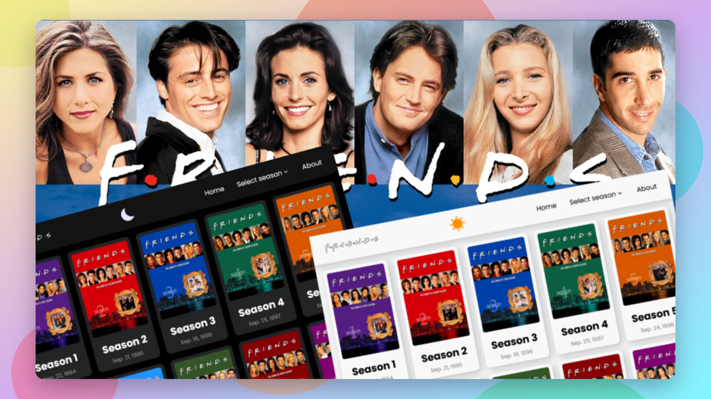

# Friends TV Series Viewer

[View Live Site](https://friends-tv-series-alamin.netlify.app)

## Overview

This project is a distraction-free viewer for the iconic "Friends" TV series. Built with vanilla JavaScript, HTML, and CSS, it provides a clean interface to browse and watch episodes without the interruption of ads or pop-ups that plague many streaming sites.

## Features

- **Clean, Ad-Free Interface**: A minimalist design focused on content
- **Dark/Light Mode**: Toggle between color schemes with automatic preference saving
- **Season & Episode Navigation**: Easily browse all seasons and episodes
- **Responsive Design**: Optimized viewing experience across devices
- **Dynamic Content Loading**: No page refreshes needed when navigating
- **Custom SPA Routing**: Smooth transitions between different sections

## Technical Implementation

### Pure Vanilla JavaScript

This project was purposely built without any frameworks or libraries as a personal challenge to deepen my understanding of core JavaScript concepts. This approach allowed me to:

- Implement custom state management
- Build a routing system from scratch
- Handle DOM manipulation directly
- Manage event listeners efficiently

### Design Approach

The application uses:

- JSON data structures for episode information
- Custom routing for single-page application behavior
- Local storage for user preferences
- Dynamic content rendering
- Custom event handling

## Legal Disclaimer

This project is a personal, non-commercial application created for educational purposes and personal use only. The website doesn't host, store, or distribute any copyrighted media content.

All video content is streamed from third-party sources (specifically "vidsrc.cc" and "crowcast.x10.mx") through their public APIs. This project simply organizes and provides an interface to access content that is already publicly available elsewhere on the internet.

I do not claim ownership of any media content accessible through this website, and all copyrighted content belongs to their respective owners. The "Friends" TV series and all related characters, storylines, and content are the property of Warner Bros. Entertainment Inc.

If you are a copyright owner and believe that content accessible through this site infringes on your rights, please contact me immediately, and I will promptly address your concerns.

This project is not affiliated with, sponsored by, or endorsed by Warner Bros. Entertainment Inc., NBC, or any entities associated with the "Friends" TV series.

## Project Background

This project stemmed from personal frustration with existing streaming options for "Friends" that were cluttered with intrusive advertisements. What began as a solution to enhance my own viewing experience evolved into a comprehensive project that helped sharpen my web development skills.

## Contributing

While this project was developed as a personal learning experience, contributions are welcome. Feel free to fork the repository and submit pull requests with improvements or fixes.

## Contact

<b>Alamin</b>

- [Twitter (@CodeWithAlamin)](https://www.twitter.com/CodeWithAlamin)
- [LinkedIn (@CodeWithAlamin)](https://www.linkedin.com/in/CodeWithAlamin)
- [Frontend Mentor (@CodeWithAlamin)](https://www.frontendmentor.io/profile/CodeWithAlamin)
- [GitHub (@CodeWithAlamin)](https://github.com/CodeWithAlamin)

## License

This project is licensed under the [MIT License](https://github.com/CodeWithAlamin/Friends-TvSeries-Site/blob/main/LICENSE.md).
